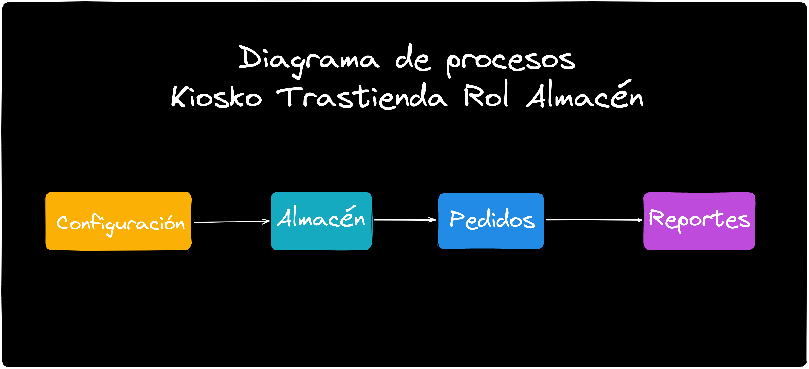
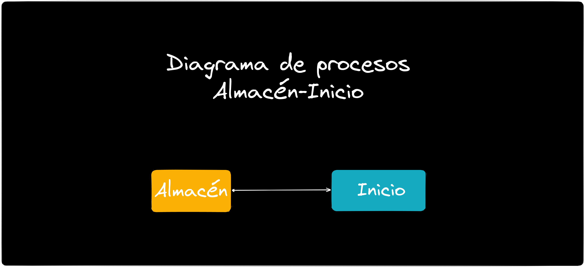
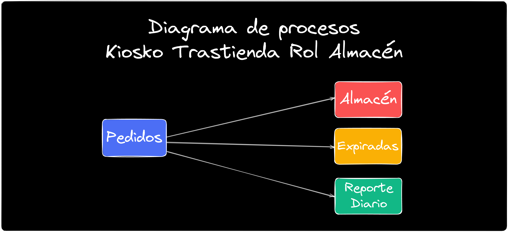
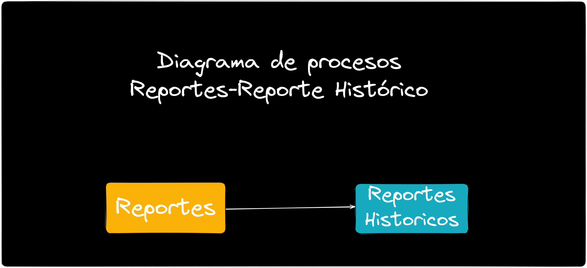
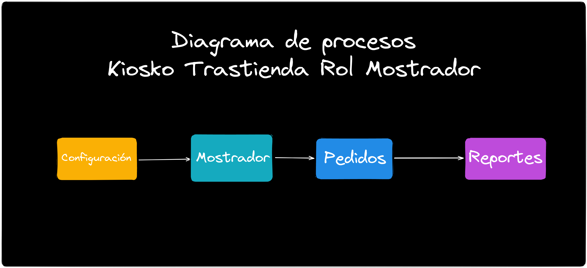
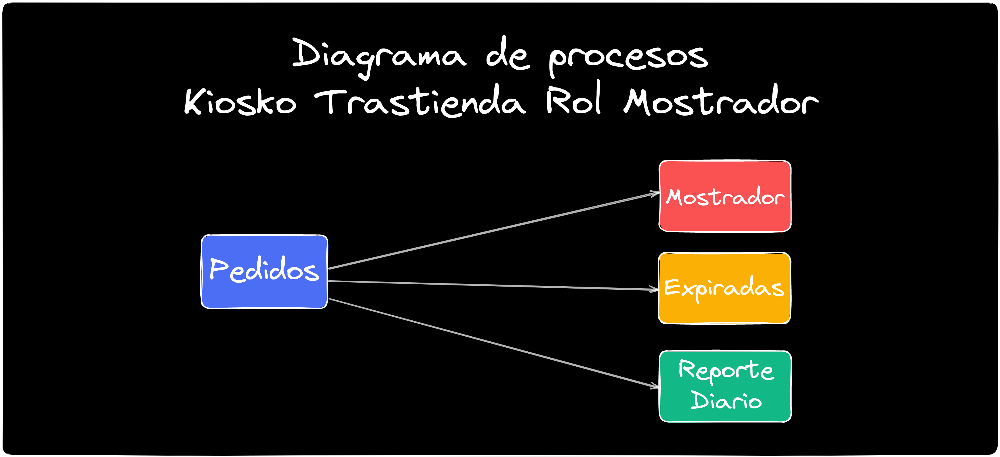
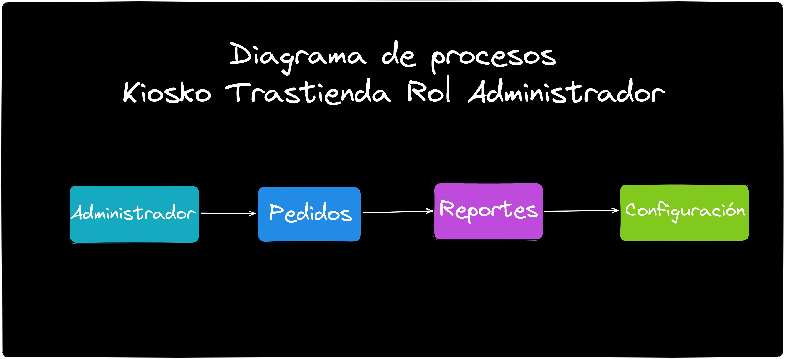
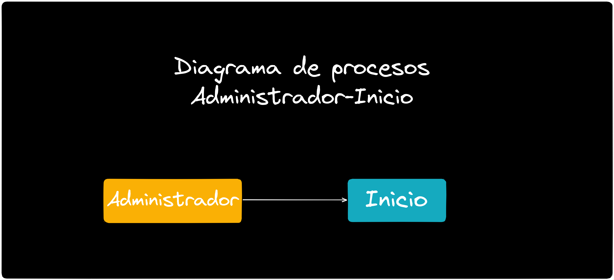
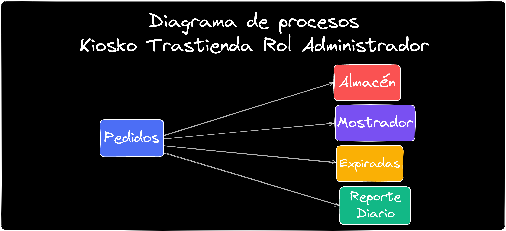
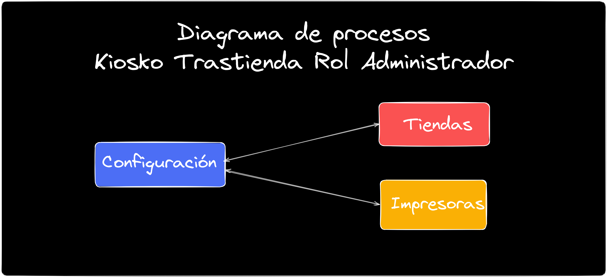

# Características

## Descripción general del sistema

>La aplicación diseñada es un sistema de gestión de control sobre los pedidos que los clientes solicitan mediante el kiosko en la tienda que facilita a los empleados de la tienda (**incluyendo a los almacenistas, mostrador y administradores**) llevar un control de los productos disponibles en el inventario. El sistema se basa en tecnologías como **Angular versión 15.2.5** para el frontend, **Node.js 18.11.18 con NestJS 9.0.0** para el servidor backend y **MariaDB, Server version: 10.5.19** como su base de datos principal. La aplicación se ha diseñado como un sistema multi-tienda, de modo que puede ser utilizado simultáneamente por diferentes tiendas.

## Arquitectura del sistema
>El sistema consiste en varias capas, incluyendo la capa de presentación, la capa de lógica del servidor y la capa de datos, donde el frontend de la aplicación se realiza en Angular 15.2.5 y el backend se implementa en Node.js 18.11.18 con NestJS 9.0.0. La aplicación utiliza una arquitectura de microservicios y se despliega en Docker para garantizar la rápida integración, implementación y escalabilidad del sistema. La base de datos utiliza MariaDB 10.5.19 y utiliza el ORM Sequelize para garantizar el control de los datos almacenados en ella.

# Usuario Rol Almacen
## Diagrama de proceso del  Rol Almacen

>En la gráfica se muestra el proceso del usuario del Rol Almacén

::: tip PROCESO ROL ALMACÉN
 En la imagen podemos apreciar los módulos que se relacionan con el Rol del Almacén  
:::

::: tip MÓDULO - ALMACÉN - INICIO
 En esta parte del sitema se realiza la configuración para seleccionar la Tienda, el tipo de usuario y asignar el personal para trabajar en el almacen y despachar los pedidos. 
:::

---

::: tip MÓDULO - PEDIDOS - ALMACÉN,EXPIRADAS,REPORTE DIARIO
 En esta parte del sitema se realiza la entrega de los pedidos del almacén al mostrador a través de ordenes,picking, se revisan las ordenes expiradas y pendientes y después se revisa el reporte diario de los pedidos para validar el estatus de cualquier pedido pendiente y el tiempo de repuesta del almacén de al momento de hacer la entrega de los pedidos.  
:::

---

::: tip MÓDULO - ALMACÉN - REPORTE HISTÓRICO
 Este módulo realiza la gestión de suministrar el histórico de los reportes de los pedidos según su naturaleza, además permite exportar la información a formato excel de manera detallada  por item o por orden.  
:::

# Usuario Rol Mostrador

## Diagrama de Proceso del Rol Mostrador

>En la imagen podemos ver el diagrama del Rol Mostrador

::: tip PROCESO ROL MOSTRADOR
 EEn la imagen podemos apreciar los módulos que se relacionan con el Rol Mostrador.
:::

::: tip MÓDULO - MOSTRADOR - INICIO
 En esta parte del sitema se realiza la configuración para seleccionar la Tienda, el tipo de usuario y asignar el personal para trabajar en el mostrador y entregar los pedidos. 
:::

---

::: tip MÓDULO - PEDIDOS - MOSTRADOR,EXPIRADAS,REPORTE DIARIO
 En esta parte del sitema se realiza la entrega de los pedidos del mostrador a los clientes  se revisan las ordenes expiradas y pendientes y después se revisa el reporte diario de los pedidos para validar el estatus de cualquier pedido pendiente.  

:::

---

::: tip MÓDULO - MOSTRADOR - REPORTE HISTÓRICO
 Este módulo realiza la gestión de suministrar el histórico de los reportes de los pedidos según su naturaleza, además permite exportar la información a formato excel de manera detallada  por item o por orden.  

:::

## Diagrama de Proceso del Usuario Rol Mostrador

>En la imagen podemos ver el diagrama del Rol Mostrador

::: tip SELECCIONAR ROL MOSTRADOR
 En la imagen se muestra la opción para seleccionar un rol administrador
:::

---
# Usuario Rol Administrador

## Diagrama de Proceso del Rol Administrador

>En la imagen nos muestra el diagrama del Rol Administrador

::: tip SELECCIONAR ROL ADMINISTRADOR
 En la imagen se muestra la opción para seleccionar un rol administrador
:::

---

::: tip MÓDULO - ADMINISTRADOR - INICIO
 En esta parte del sitema se realiza la configuración para seleccionar la Tienda, el tipo de usuario y asignar el personal para trabajar en el almacen y despachar los pedidos. 
:::

---

::: tip MÓDULO - ADMINISTRADOR - ALMACÉN,MOSTRADOR,EXPIRADAS,REPORTE DIARIO
 En esta parte del sitema se realiza la entrega de los pedidos del almacén al mostrador a través de ordenes,picking, se revisan las ordenes expiradas y pendientes y después se revisa el reporte diario de los pedidos para validar el estatus de cualquier pedido pendiente y el tiempo de repuesta del almacén de al momento de hacer la entrega de los pedidos.  
:::

---

::: tip MÓDULO - ALMACÉN - REPORTE HISTÓRICO
 Este módulo realiza la gestión de suministrar el histórico de los reportes de los pedidos según su naturaleza, además permite exportar la información a formato excel de manera detallada  por item o por orden.  
:::

::: tip MÓDULO CONFIGURACIÓN ADMINISTRADOR
 En la imagen se muestra el módulo de configuración, para agregar tiendas e impresoras.
:::
