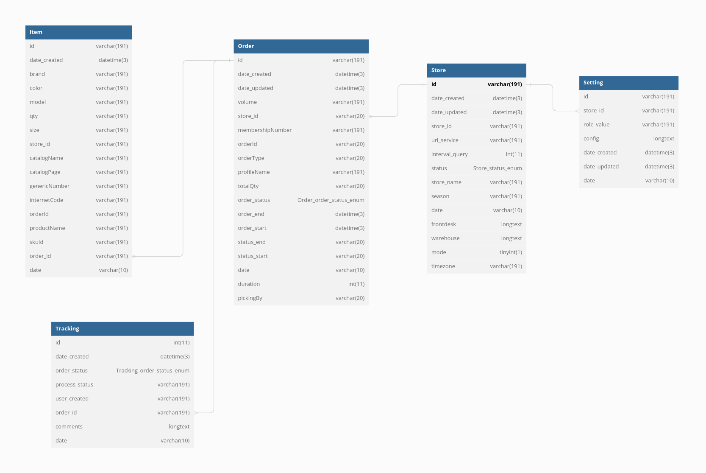

# Base de Datos 

## Diccionario de datos

>Para almacenar los datos de las transacciones del sistema, utilizamos el gestor de bases de datos **MariaDB** , contenido en un contenedor de Docker en su versión 10.5. La base de datos se llama 'KioskoTrastienda' y consta de cinco tablas: 'Item', 'Order', 'Setting', 'Store' y 'Tracking.

---

# Modelo entidad Relación

::: tip MER 
Esquema del modelo entidad relación de la base de datos **KioskoTrastienda**
:::

# Entidades - (Tablas)

## Tabla Item
| Campo           | Descripción                                                                                                              | Tipo de dato   | Restricciones        |
| --------------- | ------------------------------------------------------------------------------------------------------------------------ | -------------- | ----------------------|
| `id`            | Identificador único del registro                                                                                         | varchar(191)   | No nulo               |
| `date_created`  | Fecha y hora de creación del registro                                                                                    | datetime(3)    | Nulo por defecto      |
| `brand`         | Nombre de la marca del producto                                                                                          | varchar(191)   | No nulo               |
| `color`         | Color del producto                                                                                                       | varchar(191)   | No nulo               |
| `model`         | Modelo del producto                                                                                                      | varchar(191)   | No nulo               |
| `qty`           | Cantidad de productos                                                                                                    | varchar(191)   | No nulo               |
| `size`          | Tamaño del producto                                                                                                      | varchar(191)   | No nulo               |
| `store_id`      | Identificador de la tienda donde se compró el producto                                                                   | varchar(191)   | No nulo               |
| `catalogName`   | Nombre del catálogo donde se puede encontrar el producto                                                                 | varchar(191)   | No nulo               |
| `catalogPage`   | Página del catálogo donde se encuentra el producto                                                                       | varchar(191)   | No nulo               |
| `genericNumber` | Número genérico del producto                                                                                              | varchar(191)   | No nulo               |
| `internetCode`  | Código del producto en Internet                                                                                           | varchar(191)   | No nulo               |
| `orderId`       | Identificador del pedido al que está asociado el producto                                                                 | varchar(191)   | Nulo                  |
| `productName`   | Nombre del producto                                                                                                      | varchar(191)   | No nulo               |
| `skuId`         | Identificador único del producto en el sistema                                                                            | varchar(191)   | No nulo               |
| `order_id`      | Identificador del pedido al que está asociado el producto                                                                 | varchar(191)   | Nulo                  |
| `date`          | Fecha en que se creó el registro en formato AAAA-MM-DD                                                                    | varchar(10)    | No nulo               |

::: info  <Badge type="info" text="ITEM" />

La tabla **Item** es una tabla de una base de datos que almacena información sobre productos. Cada registro en la tabla representa un producto individual y tiene atributos como la marca, el color, el modelo, la cantidad, el tamaño, el identificador de la tienda, el nombre del catálogo, el número genérico del producto, su código en Internet, el identificador del pedido con el que está asociado y la fecha de creación del registro.

:::
## Tabla Order

| Columna           | Descripción                                                                                          | Tipo de dato                          | Restricciones              |
| ----------------- | ---------------------------------------------------------------------------------------------------- | ------------------------------------ | -------------------------- |
| `id`              | Identificador único de la orden                                                                      | varchar(191)                         | No nulo                    |
| `date_created`    | Fecha y hora de creación de la orden                                                                 | datetime(3)                          | Nulo por defecto           |
| `date_updated`    | Fecha y hora de actualización de la orden                                                            | datetime(3)                          | Nulo por defecto           |
| `volume`          | Volumen de la orden                                                                                  | varchar(191)                         | No nulo                    |
| `store_id`        | Identificador de la tienda donde se realizó la orden                                                | varchar(20)                          | No nulo                    |
| `membershipNumber`| Número de membresía asociado a la orden                                                              | varchar(191)                         | No nulo                    |
| `orderId`         | Identificador de la orden                                                                            | varchar(20)                          | No nulo                    |
| `orderType`       | Tipo de orden                                                                                        | varchar(20)                          | No nulo                    |
| `profileName`     | Nombre del perfil asociado a la orden                                                                | varchar(191)                         | No nulo                    |
| `totalQty`        | Cantidad total de productos en la orden                                                              | varchar(20)                          | No nulo                    |
| `order_status`    | Estado de la orden (enumerado con opciones "pending", "picking", "frontdesk", "delivered" y "timeout") | enum('pending','picking','frontdesk','delivered','timeout') | No nulo                    |
| `order_end`       | Fecha y hora de finalización de la orden                                                              | datetime(3)                          | Nulo por defecto           |
| `order_start`     | Fecha y hora de inicio de la orden                                                                    | datetime(3)                          | Nulo por defecto           |
| `status_end`      | Estado final de la orden                                                                             | varchar(20)                          | No nulo                    |
| `status_start`    | Estado inicial de la orden                                                                           | varchar(20)                          | No nulo                    |
| `date`            | Fecha en la que se creó la orden en formato AAAA-MM-DD                                               | varchar(10)                          | No nulo                    |
| `duration`        | Duración total de la orden (en segundos)                                                             | int(11)                               | Nulo por defecto           |
| `pickingBy`       | Persona que seleccionó o recogió los productos de la orden                                           | varchar(20)                          | Nulo por defecto           |

::: info  <Badge type="info" text="ORDER" />
 La tabla **Order** es una tabla que almacena información sobre órdenes. Cada registro en la tabla representa una orden individual y tiene atributos como el identificador de la orden, la fecha y hora de creación, tipo de orden, estado de la orden, los productos, la tienda en la que se realizó la orden, el volumen y la cantidad total de productos, la duración de la orden y la persona que recogió los productos.

 :::
## Tabla Store

| Campo            | Descripción                                                              | Tipo de dato                                        | Restricciones                                              |
| ---------------- | ------------------------------------------------------------------------ | -------------------------------------------------- | ---------------------------------------------------------- |
| `id`             | Identificador único de la tienda                                         | varchar(191)                                       | No nulo                                                    |
| `date_created`   | Fecha y hora de creación de la tienda                                     | datetime(3)                                        | Nulo por defecto                                           |
| `date_updated`   | Fecha y hora de actualización de la tienda                                | datetime(3)                                        | Nulo por defecto                                           |
| `store_id`       | Identificador de la tienda                                                | varchar(191)                                       | No nulo                                                    |
| `url_service`    | URL del servicio asociado con la tienda                                   | varchar(191)                                       | No nulo                                                    |
| `interval_query` | Intervalo de consulta de la tienda en minutos                              | int(11)                                            | No nulo                                                    |
| `status`         | Estado de la tienda                                                       | enum('active','inactive')                          | No nulo                                                    |
| `store_name`     | Nombre de la tienda                                                       | varchar(191)                                       | No nulo                                                    |
| `season`         | Temporada de la tienda                                                     | varchar(191)                                       | No nulo                                                    |
| `date`           | Fecha en la que se creó la tienda en formato AAAA-MM-DD                   | varchar(10)                                        | No nulo                                                    |
| `frontdesk`      | Datos de front desk de la tienda en formato JSON                           | longtext CHARACTER SET utf8mb4 COLLATE utf8mb4_bin | Puede ser nulo, debe estar en formato JSON válido         |
| `warehouse`      | Datos de warehouse de la tienda en formato JSON                            | longtext CHARACTER SET utf8mb4 COLLATE utf8mb4_bin | Puede ser nulo, debe estar en formato JSON válido         |
| `mode`           | Modo de prueba de la tienda                                                | tinyint(1)                                         | Puede ser nulo                                              |
| `timezone`       | Zona horaria de la tienda                                                  | varchar(191)                                       | Puede ser nulo                                              |

::: info  <Badge type="info" text="STORE" />

 La tabla **Store** se utiliza para almacenar información de tienda. Cada registro en la tabla representa una tienda y tiene atributos como el identificador de la tienda, la URL de servicio asociada, la temporada, la fecha y hora de creación y actualización de la tienda y los datos de configuración de front desk y warehouse en formato JSON.
:::
## Tabla setting 

| Campo         | Descripción                                                                      | Tipo de dato                                      | Restricciones                                              |
| ------------- | -------------------------------------------------------------------------------- | ------------------------------------------------ | ---------------------------------------------------------- |
| `id`          | Identificador único de la configuración                                          | varchar(191)                                     | No nulo                                                    |
| `store_id`    | Identificador de la tienda asociada a la configuración                          | varchar(191)                                     | No nulo                                                    |
| `role_value`  | Valor del nivel de acceso de la configuración                                    | varchar(191)                                     | No nulo                                                    |
| `config`      | Datos de configuración en formato JSON                                           | longtext CHARACTER SET utf8mb4 COLLATE utf8mb4_bin| No nulo, debe estar en formato JSON válido                 |
| `date_created`| Fecha y hora de creación de la configuración                                     | datetime(3)                                      | Nulo por defecto                                           |
| `date_updated`| Fecha y hora de actualización de la configuración                                | datetime(3)                                      | Nulo por defecto                                           |
| `date`        | Fecha en la que se creó la configuración en formato AAAA-MM-DD                   | varchar(10)                                      | No nulo                                                    |

::: info  <Badge type="info" text="SETTING" />

La tabla "Setting" es una tabla que almacena información de configuración para cada tienda. Cada registro en la tabla representa una entrada de configuración para una única tienda y tiene atributos como el identificador de configuración, la tienda asociada, el valor del nivel de acceso, los datos de configuración y la fecha y hora de creación y actualización de la configuración.

:::
## Tabla Tracking

| Campo           | Descripción                                                                        | Tipo de dato                                        | Restricciones                                  |
| --------------- | ---------------------------------------------------------------------------------- | -------------------------------------------------- | ---------------------------------------------- |
| `id`            | Identificador único de seguimiento de pedido                                        | int(11)                                            | No nulo                                        |
| `date_created`  | Fecha y hora de creación del seguimiento de pedido                                  | datetime(3)                                        | Nulo por defecto                               |
| `order_status`  | Estado de la orden                                                                  | enum('pending', 'picking', 'frontdesk', 'delivered', 'timeout') | No nulo                                 |
| `process_status`| Estado del proceso de seguimiento de pedido                                         | varchar(191)                                       | No nulo                                        |
| `user_created`  | Usuario que creó el seguimiento de pedido                                           | varchar(191)                                       | No nulo                                        |
| `order_id`      | Identificador de orden asociado al seguimiento de pedido                            | varchar(191)                                       | Puede ser nulo                                 |
| `comments`      | Comentarios sobre el proceso de seguimiento de pedido                               | longtext CHARACTER SET utf8mb4 COLLATE utf8mb4_bin | No nulo                                        |
| `date`          | Fecha en que se registró el seguimiento de pedido en formato AAAA-MM-DD             | varchar(10)                                        | No nulo                                        |

::: info  <Badge type="info" text="TRACKING" />

 La tabla "Tracking" se utiliza para almacenar información sobre el seguimiento de pedidos. Cada registro en la tabla representa un seguimiento de pedido y tiene atributos como un identificador único de seguimiento de pedido, la fecha y hora de creación del seguimiento, el estado de la orden, el estado del proceso de seguimiento, el usuario que creó el registro, los comentarios sobre el proceso de seguimiento, y la fecha en que se registró el seguimiento de pedido.
:::