# Bienvenidos a la página Rol administrador

### Rol Administrador

::: info ADMINISTRADOR

:::

--- 

>**Rol Administrador:** Los usuarios con el Rol Administrador en Kiosko Trastienda tienen acceso a todas las funciones que realizan los usuarios del Rol Amacén, Mostrar, adicionalmente  pueden Configurar tiendas e impresoras.  

### Menú Rol Administrador

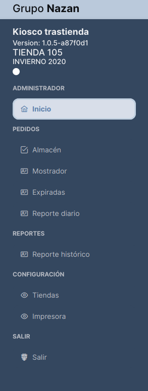

::: info <Badge type="info" text="MENÚ - USUARIO ROL ADMINISTRADOR"/>
---

 **Descripción del Menú:**

1. **Logo Grupo Nazan**
2. **Nombre del Sistema, versión, número de  tienda, Colección**
3. **Navegación del menú con los módulos Almacén "Inicio", Pedidos "Almacén. Expiradas, Reporte diario", Reportes "Reporte histórico",Configuración, "Tiendas", "Impresora", Salir "Salir")**
:::

---
::: warning <Badge type="info" text="MENÚ - USUARIO ROL ADMINISTRADOR"/>
---

 **Consideraciones:**
 Es importante tener en cuenta que el módulo de PEDIDOS en la instancia del administrador se encuentra en nivel de consulta. para conocer información del rol de Almacén pueden ir: **[Ver Almacen](./users_rol_almacen)** o al Rol mostrador **[Ver Mostrador](./users_rol_mostrador)**"

:::

---

### Dashboard Usuario Rol Administrador

---

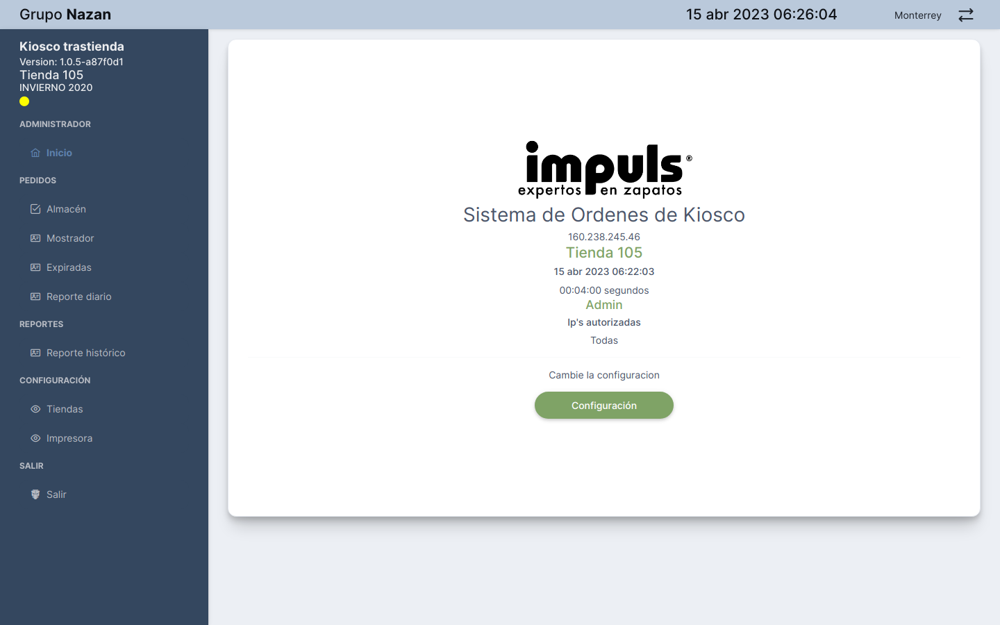

> Cuando iniciamos el sistema, nos muestra la interfaz del dashboard en la vista welcome/home, que tiene una tarjeta con las siguientes características: El icono de la tienda, el nombre del sistema, dirección ip de la tienda, un botón para realizar la configuración inicial, que nos permite seleccionar la tienda, el tipo de Rol del usuario y los nombres de los usuarios. 

---

### Configuración Usuario Rol Administrador

---

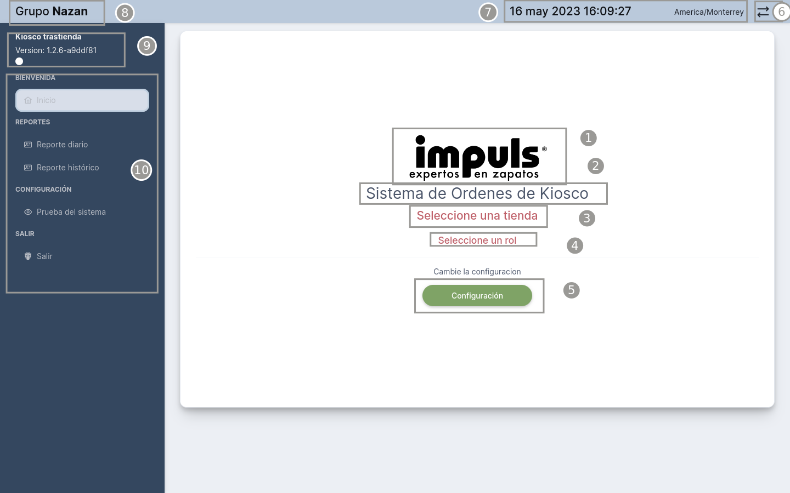

::: info <Badge type="info" text="MENÚ - USUARIO ROL ALMACÉN"/>
---

 **Descrición del Dashboard:**

1. Fecha y hora, ciudad
2. Logo de la Tienda
3. Nombre de la aplicación
4. Dirección Ip servidor
5. Opción para seleccionar una tienda
6. Opción para seleccionar un rol
7. Botón de configuración
8. Menú de navegación principal
9. Logotipo Gurpo Nazan. 
:::

## Seleccionar una tienda

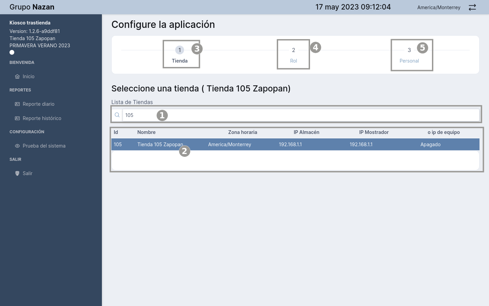

---

::: tip <Badge type="info" text="MENÚ - CONFIGURACIÓN"/>
---

 **Configuración Inicial:**

1. Campo de busqueda de tienda
2. Listado de la Tienda
3. Seleccionar Tienda
4. Seleccionar Rol
5. Agregar Persona

:::

## Configuraciones del Sistema

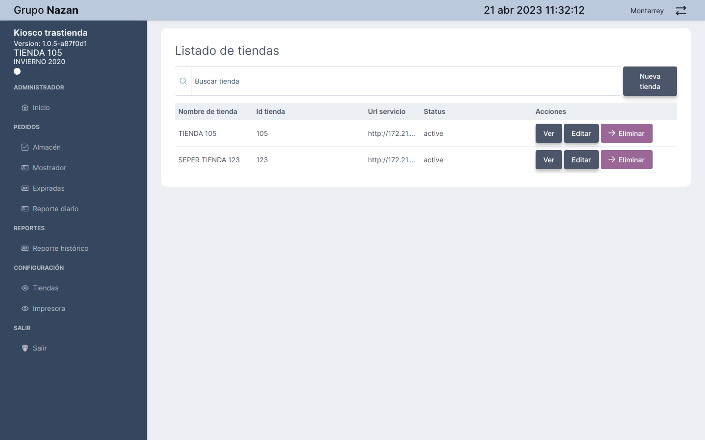

## Menú Tienda

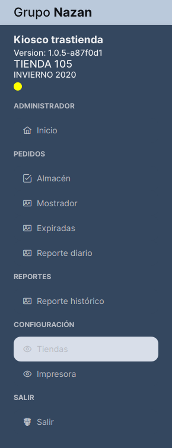

## Crear una tienda

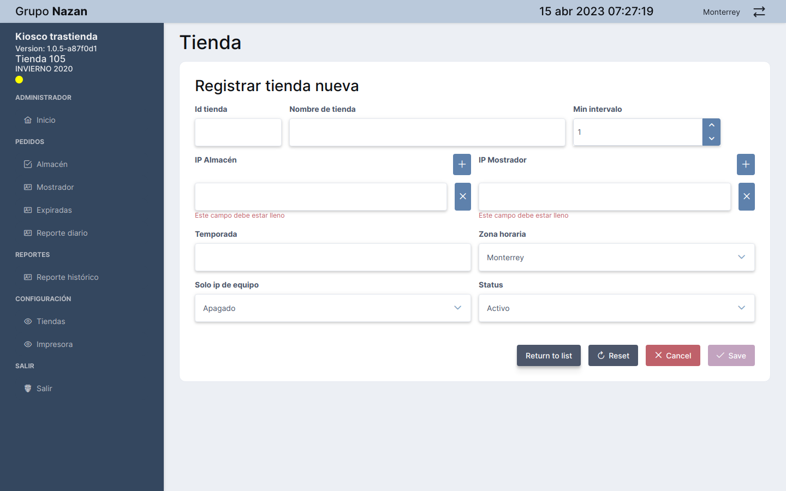

::: tip CREAR NUEVA TIENDA
 Si deseas crear una nueva tienda, el primer paso es completar el formulario de registro correspondiente. En la imagen adjunta se puede observar dicho formulario, el cual consta de diversos campos que deberás rellenar con información precisa y detallada acerca de la nueva tienda que deseas acontinuacion se describen los campos del formulario: 

 1. **Id tienda** contendra el id de la nueva tienda
 2. **Nombre del la tienda**
 3. **Min intervalo** cantidad de intervalo de actualización de los registros.
 4. **Ip Almacén** Dirección ip del almacén
 5. **Ip Mostrador** Dirección ip del mostrador
 6. **Temporada** nombre del colección
 7. **Solo ip del equipo** 
 8. **Status**
:::

## Editar una tienda

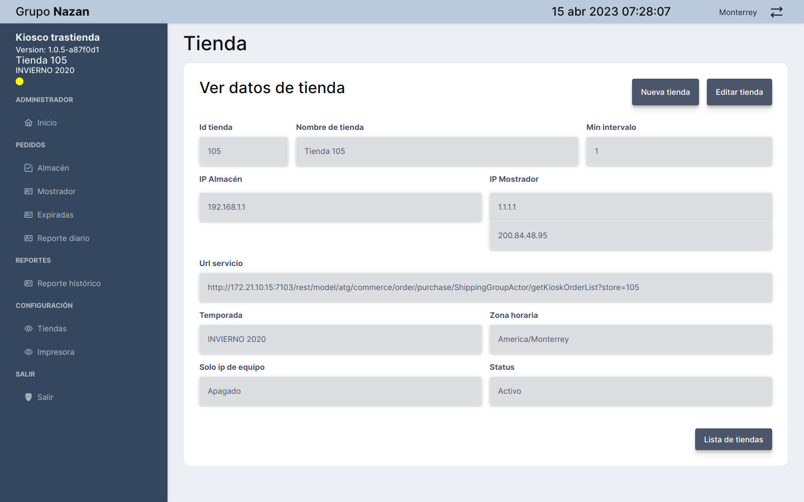

---

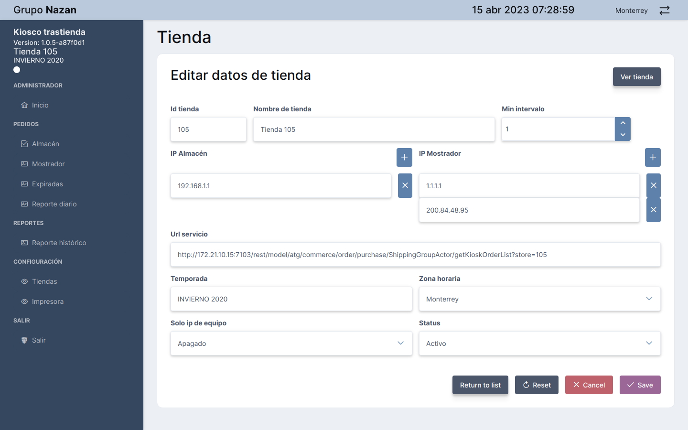
::: tip EDITAR TIENDA
 Si deseas editar la información de una tienda, deberás acceder a la sección de edición correspondiente. Una vez allí, encontrarás un formulario que muestra los campos que puedes modificar. A continuación, se detallan los campos que podrás editar para actualizar la información de la tienda:
 1. **Id tienda** contendra el id de la nueva tienda
 2. **Nombre del la tienda**
 3. **Min intervalo** cantidad de intervalo de actualización de los registros.
 4. **Ip Almacén** Dirección ip del almacén
 5. **Ip Mostrador** Dirección ip del mostrador
 6. **Temporada** nombre del colección
 7. **Solo ip del equipo** 
 8. **Status**
:::

## Configuración impresora

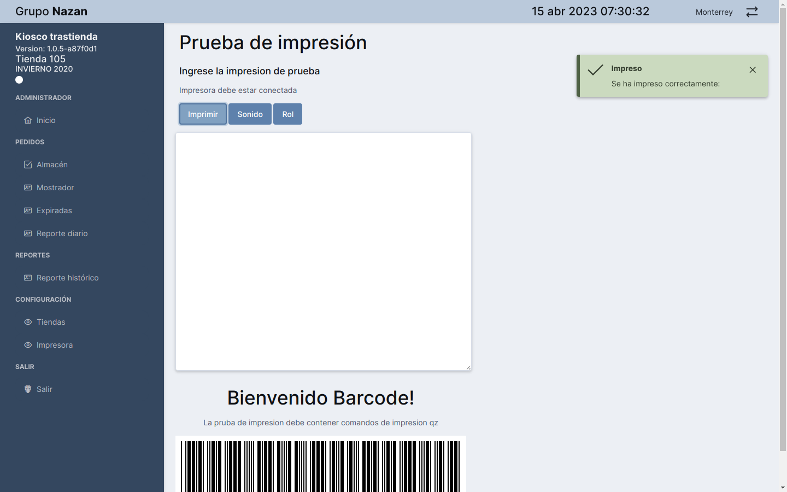

::: tip CONFIGURAR IMPRESORA
 En la imagen se muestra la opcion para configurar la impresora, con el boton imprimir validamos si hay conexion con la impresora, el boton sonido nos arroja el sonido que tendrá la alarma de laerta del almacén y el boton Rol 

:::

## Seleccionar Rol

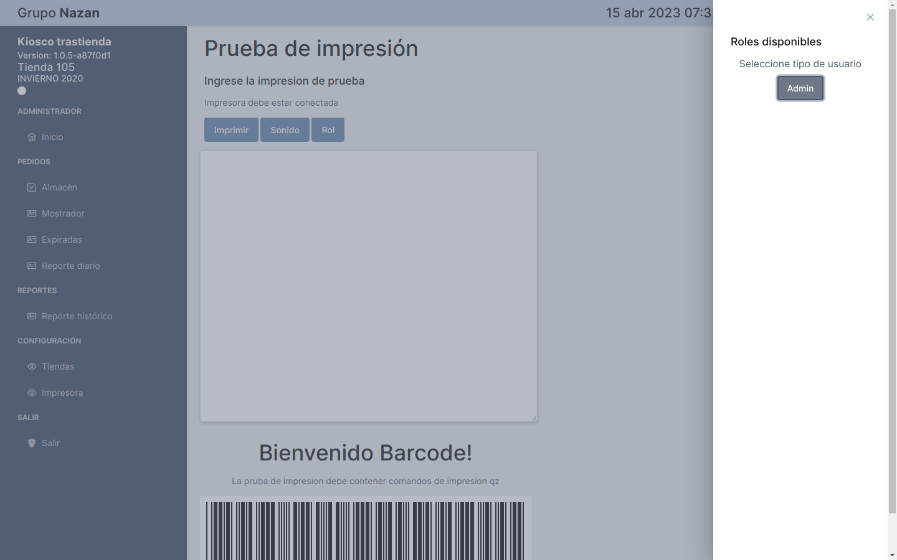

::: tip SELECCIONAR ROL ADMINISTRADOR
 En la imagen se muestra la opción para seleccionar un rol administrador
:::