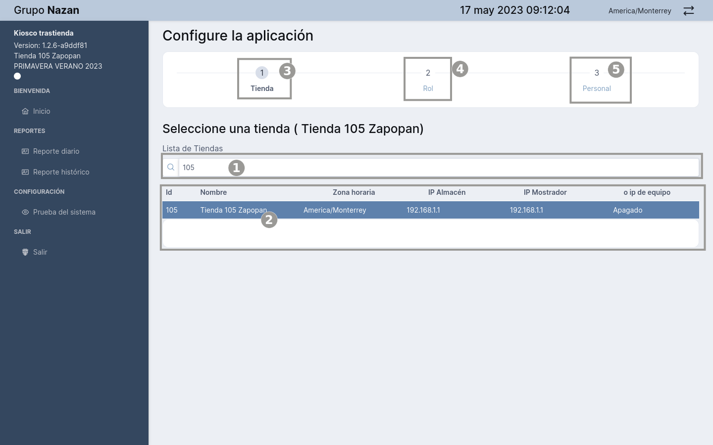

# Bienvenidos a la página rol almacén

### Módulo Almacén

::: info ALMACÉN

:::

>**Rol Almacén:** Los usuarios con el **Rol Almacén** en **Kiosko Trastienda** tienen acceso a funciones específicas para gestionar las órdenes de pedidos  de la tienda. Esto incluye la capacidad de registrar y visualizar las órdenes pendientes, a través de un listado que contiene los siguientes campos: **Pedido** almacena el  número del pedido, **Hora** almacena la hora del registro del pedido, **Pares** números de items, **Socio** código del socio, **Status**  que muestra un círculo que simula un semáforo  que indica el tiempo de retraso del pedido con tres colores **Verde**  tiene un intervalo de tiempo menor a 3 minutos, **Amarillo**  tiene un inertvalo entre 3 y 5 minutos y **Rojo**  un intervalo mayor de 5 minutos, **Nota**:    ***Los pedidos no atendidos se cierran en automático a los 30 minutos***., el campo acciones tiene los botones de las opciónes de **ver los detalles del pedido, ver el historial del pedido y pasar pedidos a Órdenes picking**. Que tiene los mismos campos de la tabla Ordenes pendientes, con la excepción del campo acciones que tiene un botón con el icono de impresora que tiene la función de imprimir un ticket con el número del pedido. 

---
## Video

## Detalles pedidos

## Markdown Content

The count is: {{ count }}

<button :class="$style.button" @click="count++">Increment</button>

<template>
  

    <video controls width="640" height="360">
      <source src="./public/assets/videos/usuarioalmacen.mp4" type="video/mp4">
    </video>
  

</template>

<template>
  

    <video width="640" height="360" controls>
      <source v-bind:src="rutaVideo" type="video/mp4">
    </video>
  

</template>

### Menú Rol Almacén

---

::: info <Badge type="info" text="MENÚ - USUARIO ROL ALMACÉN"/>
---

 **Descripción del Menú:**

1. **Logo Grupo Nazan**
2. **Nombre del Sistema, versión, número de  tienda, Colección, Tipo Usuario**
3. **Navegación del menú con los módulos Almacén "Inicio", Pedidos "Almacén. Expiradas, Reporte diario", Reportes "Reporte histórico", Salir "Salir")**
:::

---

### Módulo Almacén

---

> Cuando iniciamos el sistema, nos muestra la interfaz del dashboard en la vista welcome/home, que tiene una tarjeta con las siguientes características: El icono de la tienda, el nombre del sistema, dirección ip de la tienda, un botón para realizar la configuración inicial, que nos permite seleccionar la tienda, el tipo de Rol del usuario y los nombres de los usuarios. 

---

### Configuración Usuario Rol Almacén

---

::: info <Badge type="info" text="MENÚ - USUARIO ROL ALMACÉN"/>
---

 **Descripción del Dashboard:**

1. Logo de la Tienda
2. Nombre de la aplicación
3. Opción para seleccionar una tienda
4. Opción para seleccionar un rol
5. Botón de configuración
6. Botón para Mostrar/Ocultar el menú de navegación
7. Fecha, hora y localidad
8. Logotipo Gurpo Nazan
9. Versión del sistema
10. Menú Principal del sistema
:::

## Seleccionar una tienda

---

---

> Para selecionar una tienda se debe hacer clic en el nombre de la tienda, que posteriormente saldrá un cuadro de mensaje pidiendo la confirmación de la selección con la opciones si/no, seleccionamos con el botón si para confirmar, saldra un mensaje notificando la confirmacion de la tienda seleccionada.  

---

---

::: tip <Badge type="info" text="MENÚ - CONFIGURACIÓN"/>

---

 **Configuración Inicial:**

1. Campo de busqueda de tienda
2. Listado de la Tienda
3. Seleccionar Tienda (**Id, nombre, Zona Horaria, Ip Almacén, Ip Mpstrador, Ip Equipo**)
4. Seleccionar Rol
5. Seleccionar Persona

:::

## Seleccionar un rol

::: tip ROL

> Continuando con la configuración ahora tendremos que seleccionar el rol del usuario que son: **Almacén, Mostrador o Administrador**.
>

:::

---

::: tip SELECCIÓN

> Haciendo click en el número **2 ROL** nos muestra la opción para seleccionar un rol para el usuario que va a utilizar el sistema.

:::

::: tip CONFIRMACIÓN

> Ahora que seleccionamos el rol del usuario, sólo queda asignar el nombre del usuario y el codigo para finalizar con esta etapa de configuración.

:::

## Asignar Personal

::: tip ASIGNAR PERSONAL

> Continuando con la configuración ahora tendremos que asignar el personal para que pueda utilizar el sistema.

:::

---

---

::: tip CONFIRMADO

> Ya con la configuración inicial del usuario almacen realizada, el usuario debe navegar al menu principal y en el módulo Pedidos seleccionar la opción del menú Almacen, haciendo clic, para mostrar el dasborad principal de pedidos en almacén.

:::

## Módulo Almacén Inicio

---

## Módulo Almacen Dashboard Principal

::: tip DASHBOARD PRINCIPAL PEDIDOS EN ALMACEN

> En la presente imagen podemos apreciar la interfaz gráfica del dashboard Almacen.

:::

---

::: tip <Badge type="info" text="MENÚ - DASHBOARD"/>

---

 **Elementos de la interfáz:**

1. Tarjeta estadísticas Pedidos ("**Muestra las estadísticas de la cantidad de totales items,procesados y promedios de entrega de los pedidos en tiempo**").
2. Tarjeta estadísticas Pendientes ("**Muestra la infomación estadistica en porcentaje de los items pendientes por entregar al mostrador**").
3. Tarjeta estadísticas Recolección ("**Muestra la infomación estadistica en porcentaje de los items pendientes por entregar al mostrador**").
4. Tarjeta estadísticas Mostrador.
5. Tarjeta estadísticas Entregados.
6. Tarjeta estadísticas Expirados.
7. Listado ordenes pendientes.
8. Listado Ordenes en recolección.

:::

## Buscar Órdenes pendientes

---

---

::: tip BUSCAR ORDENES PENDIENTES

> Cuando se selecciona el icono <svg width="32px" height="32px" viewBox="0 0 24 24" fill="none" xmlns="http://www.w3.org/2000/svg" stroke="#b8b8b8"><g id="SVGRepo_bgCarrier" stroke-width="0"></g><g id="SVGRepo_tracerCarrier" stroke-linecap="round" stroke-linejoin="round"></g><g id="SVGRepo_iconCarrier"> <path d="M7.83334 13.6C8.25804 14.4031 8.97945 15.0676 9.88888 15.4934C10.7983 15.9191 11.8465 16.083 12.8755 15.9604C13.9045 15.8378 14.8586 15.4353 15.594 14.8136L17 13.7451M17 16V13.6H14.5M16.1667 10.4C15.742 9.59687 15.0206 8.93238 14.1111 8.50664C13.2017 8.08091 12.1535 7.91699 11.1245 8.03959C10.0955 8.16219 9.1414 8.56467 8.40599 9.18637L7 10.2549M7 8V10.4H9.5M21 12C21 16.9706 16.9706 21 12 21C7.02944 21 3 16.9706 3 12C3 7.02944 7.02944 3 12 3C16.9706 3 21 7.02944 21 12Z" stroke="#b8b8b8" stroke-width="1.5" stroke-linecap="round" stroke-linejoin="round"></path> </g></svg> se referescan los datos en la tabla actualizando la informacion de los nuevas ordenes que se hayan generado.

>

:::

## Detalles pedidos

---

---

---

::: tip DETALLES PEDIDOS

> Cuando se selecciona el icono <svg width="24px" height="24px" viewBox="0 0 24 24" fill="none" xmlns="http://www.w3.org/2000/svg" stroke=""><g id="SVGRepo_bgCarrier" stroke-width="0"></g><g id="SVGRepo_tracerCarrier" stroke-linecap="round" stroke-linejoin="round"></g><g id="SVGRepo_iconCarrier"> <path fill-rule="evenodd" clip-rule="evenodd" d="M6.30147 15.5771C4.77832 14.2684 3.6904 12.7726 3.18002 12C3.6904 11.2274 4.77832 9.73158 6.30147 8.42294C7.87402 7.07185 9.81574 6 12 6C14.1843 6 16.1261 7.07185 17.6986 8.42294C19.2218 9.73158 20.3097 11.2274 20.8201 12C20.3097 12.7726 19.2218 14.2684 17.6986 15.5771C16.1261 16.9282 14.1843 18 12 18C9.81574 18 7.87402 16.9282 6.30147 15.5771ZM12 4C9.14754 4 6.75717 5.39462 4.99812 6.90595C3.23268 8.42276 2.00757 10.1376 1.46387 10.9698C1.05306 11.5985 1.05306 12.4015 1.46387 13.0302C2.00757 13.8624 3.23268 15.5772 4.99812 17.0941C6.75717 18.6054 9.14754 20 12 20C14.8525 20 17.2429 18.6054 19.002 17.0941C20.7674 15.5772 21.9925 13.8624 22.5362 13.0302C22.947 12.4015 22.947 11.5985 22.5362 10.9698C21.9925 10.1376 20.7674 8.42276 19.002 6.90595C17.2429 5.39462 14.8525 4 12 4ZM10 12C10 10.8954 10.8955 10 12 10C13.1046 10 14 10.8954 14 12C14 13.1046 13.1046 14 12 14C10.8955 14 10 13.1046 10 12ZM12 8C9.7909 8 8.00004 9.79086 8.00004 12C8.00004 14.2091 9.7909 16 12 16C14.2092 16 16 14.2091 16 12C16 9.79086 14.2092 8 12 8Z" fill="#b8b8b8"></path> </g></svg> nos muestra un cuadro de mensaje con la siguiente información: Detalles del pedido, Número, del pedido **Pedido**, fecha en que se realizó el pedido **Fecha**, Estado del pedido **Status**, cantidad de items **Items**, adicional se muestra una tabla con los siguientes campos: **SKU** Código del producto, **Cantidad** número de la cantidad de items, **Descripcion** describre breve información sobre el producto.  
>

:::

## Recolección Pedidos

---

---

::: tip ORDEN EN RECOLECCIÓN

> En la imagen se puede observar un mensaje de dialogo mostrando la información del Tracking del Pedido que se describen a continuación: **Pedido** Número del pedido, **Fecha** fecha de creación del pedido, **Status** estado del tracking, **Items** Cantidad de item, **Tiempo de almacen** tiempo en respuesta para despachar el producto, tabiem se muestra una tabla con los siguientes campos: Fecha, Status, Comentarios. 
>

:::

## Ordenes Pendientes

---

::: tip VER HISTORIAL DE PEDIDOS

> Haciendo clic sobre el icono 
 del campo acciones pasamos las ordenes pendientes a ordenes en recolección. **NOTA**: Para habilitar el boton de pasar pedidos a recolección se debe seleccionar un Almacenista, ya que por defecto esta acción se encuentra desabiitada.
>

:::

::: tip     SELECCIÓN ALMACENISTA

Como podemos ver el la imagen se debe seleccionar el almacenista para poder habilitar  el boton de pasar pedidos a recolección.>
:::

---

::: tip     SELECCIÓN ALMACENISTA-

Como podemos ver el la imagen cuando seleccionamos al almacenista encima del campo de selección se habilita una etiqueta con el nombre **almacenista y el número de identificación**, despúes el botón con el ícono de la flecha se habilita para pasar el pedido a recolección.
:::
---

::: tip PASAR PEDIDOS A ORDENES DE RECOLECCIÓN 

> Como se muestra en la imagen, aparece un cuadro de mensaje que indica que la orden se ha impreso correctamente y que se ha asignado correctamente.
>

:::
## Detalles Ordenes Recolección

---

---

::: tip PASAR DETALLES ORDEN EN RECOLECCIÓN

> Como se muestra en la imagen, aparece un cuadro de mensaje que indica los detalles del pedido: número de pedido, fecha y hora, status, atendida por, items y una tabla con los detalle de cada items con los capmos SKU, Cantidad, descripción.
 
:::

## Recolección del Pedido

---

---

::: tip TRACKING DEL PEDIDO

> Como se muestra en la imagen, aparece un cuadro de mensaje que indica los detalles del pedido: número de pedido, fecha y hora, status, items y una tabla con los detalle de cada items con los capmos SKU, Cantidad, descripción.
 
:::

---

## Reimprimir

---

::: tip IMPRIMIR ORDEN PICKING

> En la imagen  se muestra el icono de impresora <svg width="32px" height="32px" viewBox="0 0 24 24" fill="none" xmlns="http://www.w3.org/2000/svg"><g id="SVGRepo_bgCarrier" stroke-width="0"></g><g id="SVGRepo_tracerCarrier" stroke-linecap="round" stroke-linejoin="round"></g><g id="SVGRepo_iconCarrier"> <path d="M18 16.75H16C15.8011 16.75 15.6103 16.671 15.4697 16.5303C15.329 16.3897 15.25 16.1989 15.25 16C15.25 15.8011 15.329 15.6103 15.4697 15.4697C15.6103 15.329 15.8011 15.25 16 15.25H18C18.3315 15.25 18.6495 15.1183 18.8839 14.8839C19.1183 14.6495 19.25 14.3315 19.25 14V10C19.25 9.66848 19.1183 9.35054 18.8839 9.11612C18.6495 8.8817 18.3315 8.75 18 8.75H6C5.66848 8.75 5.35054 8.8817 5.11612 9.11612C4.8817 9.35054 4.75 9.66848 4.75 10V14C4.75 14.3315 4.8817 14.6495 5.11612 14.8839C5.35054 15.1183 5.66848 15.25 6 15.25H8C8.19891 15.25 8.38968 15.329 8.53033 15.4697C8.67098 15.6103 8.75 15.8011 8.75 16C8.75 16.1989 8.67098 16.3897 8.53033 16.5303C8.38968 16.671 8.19891 16.75 8 16.75H6C5.27065 16.75 4.57118 16.4603 4.05546 15.9445C3.53973 15.4288 3.25 14.7293 3.25 14V10C3.25 9.27065 3.53973 8.57118 4.05546 8.05546C4.57118 7.53973 5.27065 7.25 6 7.25H18C18.7293 7.25 19.4288 7.53973 19.9445 8.05546C20.4603 8.57118 20.75 9.27065 20.75 10V14C20.75 14.7293 20.4603 15.4288 19.9445 15.9445C19.4288 16.4603 18.7293 16.75 18 16.75Z" fill="#B8B8B8"></path> <path d="M16 8.75C15.8019 8.74741 15.6126 8.66756 15.4725 8.52747C15.3324 8.38737 15.2526 8.19811 15.25 8V4.75H8.75V8C8.75 8.19891 8.67098 8.38968 8.53033 8.53033C8.38968 8.67098 8.19891 8.75 8 8.75C7.80109 8.75 7.61032 8.67098 7.46967 8.53033C7.32902 8.38968 7.25 8.19891 7.25 8V4.5C7.25 4.16848 7.3817 3.85054 7.61612 3.61612C7.85054 3.3817 8.16848 3.25 8.5 3.25H15.5C15.8315 3.25 16.1495 3.3817 16.3839 3.61612C16.6183 3.85054 16.75 4.16848 16.75 4.5V8C16.7474 8.19811 16.6676 8.38737 16.5275 8.52747C16.3874 8.66756 16.1981 8.74741 16 8.75Z" fill="#B8B8B8"></path> <path d="M15.5 20.75H8.5C8.16848 20.75 7.85054 20.6183 7.61612 20.3839C7.3817 20.1495 7.25 19.8315 7.25 19.5V12.5C7.25 12.1685 7.3817 11.8505 7.61612 11.6161C7.85054 11.3817 8.16848 11.25 8.5 11.25H15.5C15.8315 11.25 16.1495 11.3817 16.3839 11.6161C16.6183 11.8505 16.75 12.1685 16.75 12.5V19.5C16.75 19.8315 16.6183 20.1495 16.3839 20.3839C16.1495 20.6183 15.8315 20.75 15.5 20.75ZM8.75 19.25H15.25V12.75H8.75V19.25Z" fill="#B8B8B8"></path> </g></svg> que realiza la acción de imprimir el ticket de la orden del picking.
 
:::

---

---

::: tip IMPRIMIR ORDEN PICKING

> Ya impreso la orden picking pasa la información al mostrador para continuar con el proceso de entrega del producto del cliente una vez realizdo el pago correspondiente de los productos  adquiridos.

:::

## Expiradas

::: tip ORDENES EXPIRADAS

> Este módulo contiene la información de los pedidos que no fueron atendidos en un lapso mayor de 30 minitos, **Nota:** el sistema  emite un sonido dando la alerta de que existen pedidos en el almacén, que no se realizado la gestión de entrega, la alarma se apagan cuando se despachan todos los pedidos o si pasan más de 30 minutos, cuando se da esa condición los registros no se muentran en la lista de Ordenes pendientes y se registran en la tabla de pedidos expirados por tiempo de módulo Expiradas.

:::

---

### Menú Pedidos expirados

### Pedidos expirados

---

---
::: tip <Badge type="info" text="PEDIDOS - EXPIRADOS"/>

---

 **Elementos de la interfáz:**

1. Tarjeta estadísticas Expiradas.
2. Tarjeta estadísticas Entregados.
3. Tarjeta estadísticas Mostrador.
4. Tarjeta estadísticas Recolección.
5. Tarjeta estadísticas Pendientes.
6. Tarjeta estadísticas Totales procesados Promedios.
7. Listado de pedidos expirados por tiempo.
    >**Información en tiempo real:** Las tarjetas con las descripción estadística muestra los datos en tiempo real ya que cada tipo de usuario puede ver la información 

:::

### Pedidos expirados Detalles
---

---
::: tip PEDIDOS EXPIRADOS POR TIEMPO

> En la imagen se puede observar los datos en detalle del pedido haciendo clic en el icono. 

:::

### Pedidos expirados Tracking

---

---
::: tip TRACKING DEL PEDIDO

> En la imagen se puede observar los datos en detalle del  Tracking del pedido haciendo clic en el icono. <svg width="24px" height="24px" viewBox="0 0 1024 1024" xmlns="http://www.w3.org/2000/svg" fill="#000000"><g id="SVGRepo_bgCarrier" stroke-width="0"></g><g id="SVGRepo_tracerCarrier" stroke-linecap="round" stroke-linejoin="round"></g><g id="SVGRepo_iconCarrier"><path fill="#b8b8b8" d="M512 896a384 384 0 1 0 0-768 384 384 0 0 0 0 768zm0 64a448 448 0 1 1 0-896 448 448 0 0 1 0 896z"></path><path fill="#b8b8b8" d="M480 256a32 32 0 0 1 32 32v256a32 32 0 0 1-64 0V288a32 32 0 0 1 32-32z"></path><path fill="#b8b8b8" d="M480 512h256q32 0 32 32t-32 32H480q-32 0-32-32t32-32z"></path></g></svg>

:::

## Reporte Diario

::: tip REPORTE DIARIO

> Este módulo contiene la información de la gestión de los pedidos, a través de una tabla que contiene los siguientes campos:

 >  1. **Pedido** 
 >  2. **Inicio de orden** 
 >  3. **Socio** 
 >  4. **Pares** 
 >  5. **Status Almacén** 
 >  6. **Duración** 
 >  7. **Nombre del perfil** 
 >  8. **Iconos ver detalles del pedido y tracking del pedido**

:::

### Menú Reporte diario

### Listado de Reporte diario

---

---

### Listado de Reporte diario filtros 

---

::: tip REPORTE DIARIO FILTROS

En la imagen se muestra un menú desplegable que permite al usuario aplicar diferentes filtros. Al seleccionar uno de los siguientes elementos (**Todos, Pendientes, Recolección, Mostrador, Entregado, Expirados**), solo se mostrarán los resultados que corresponden a esa opción. Además, el campo de búsqueda permite filtrar los resultados por número de pedido..

 
:::
---

::: tip REPORTE DIARIO ***FILTRO ENTREGADO***

En la imagen se muestra que al seleccionar el filtro 'Entregado' y luego ingresar el número correspondiente en el campo de búsqueda, se obtienen los datos de los pedidos que cumplen con este criterio específico.
 
:::

---

::: tip REPORTE DIARIO ***FILTRO EXPIRADO***

En la imagen podemos observar que al seleccionar el filtro de Expirado y colocando el número en el campo de busqueda nos trae los datos de los pedidos que cumplen con ese criterio.
 
:::

## Reporte Histórico

::: tip REPORTE HISTÓRICO

Este módulo incluye el informe completo del historial de pedidos, permitiendo al usuario buscar información en tiempo real a través del filtro de fechas. Además, cuenta con dos botones para descargar archivos en formato Excel, uno para las órdenes y otro para los productos, complemntando con los filtros del dropdown y el campo de busqueda.

:::

---

### Menú Reporte Histórico

## Reporte Histórico

::: tip REPORTE HISTÓRICO

Este módulo incluye el informe completo del historial de pedidos, permitiendo al usuario buscar información en tiempo real a través del filtro de fechas. Además, cuenta con dos botones para descargar archivos en formato Excel, uno para las órdenes y otro para los productos, complemntando con los filtros del dropdown y el campo de busqueda.

:::

### Módulo Reporte histórico 

---
::: tip REPORTE HISTÓRICO

Este módulo incluye el informe completo del historial de pedidos, permitiendo al usuario buscar información en tiempo real a través del filtro de fechas. Además, cuenta con dos botones para descargar archivos en formato Excel, uno para las órdenes y otro para los productos, complemntando con los filtros del dropdown y el campo de busqueda.

:::

### Módulo Reporte histórico Fecha

::: tip REPORTE HISTÓRICO FILTRO FECHA

Como se muestra en la imagen el campo fecha prémite seleccionar entre fechas para buscar una orden.

:::

---

### Módulo Reporte histórico Fecha filtro busqueda

::: tip REPORTE HISTÓRICO FILTRO FECHA

Como se muestra en la imagen al momento de seleccionar le fecha, se muestra en la lista los registro ocurridos en la seleccion, tambie se pueden filtra por el campo busqueda y el dropdown para hacer una consulta específica. 

:::

### Módulo Reporte histórico exportar Archivo

::: tip REPORTE HISTÓRICO EXPORTAR 

Como se muestra en la imagen al momento hay dos botones para exportar los registros en formato de excel en primero lo exporta por oreden y el segundo en detalle por intems.

:::

---
### Exportar por Item

---

---

### Exporta por Order

---

### Salir de la Aplicación

::: tip SALIR DEL SISTEMA 

Para salir del sistema seleccionamos el menú salir y cerramos el proceso, luego nos lleva a al dashboard welcome/home para realizar las configuraciones iniciales al momento de un nuevo ingreso a la aplicación.

:::

---
### Dashboard Inicio

