# Bienvenidos a la página rol mostrador

### Rol Mostrador

::: info MOSTRADOR

:::

>**Rol Mostrador:** Los usuarios con el Rol Mostrado en Kiosko Trastienda tienen acceso a funciones específicas para gestionar las órdenes de pedidos en el mostrador enviadas del almacen y realizar la gestión de entrega de los pedidos a los clientes, este tipo de usuario puede ver las estadisticas en tiempo real de los procesos con los pedidos.
---

### Menú Rol Mostrador

---

::: info <Badge type="info" text="MENÚ - USUARIO ROL MOSTRADOR"/>
---

 **Descripción del Menú:**

1. **Logo Grupo Nazan**
2. **Nombre del Sistema, versión, número de  tienda, Colección, Tipo usuario**
3. **Navegación del menú con los módulos Mostrador "Inicio", Pedidos "Mostrador, Expiradas, Reporte diario", Reportes "Reporte histórico", Salir "Salir")**
:::

---

### Módulo Mostrador

---

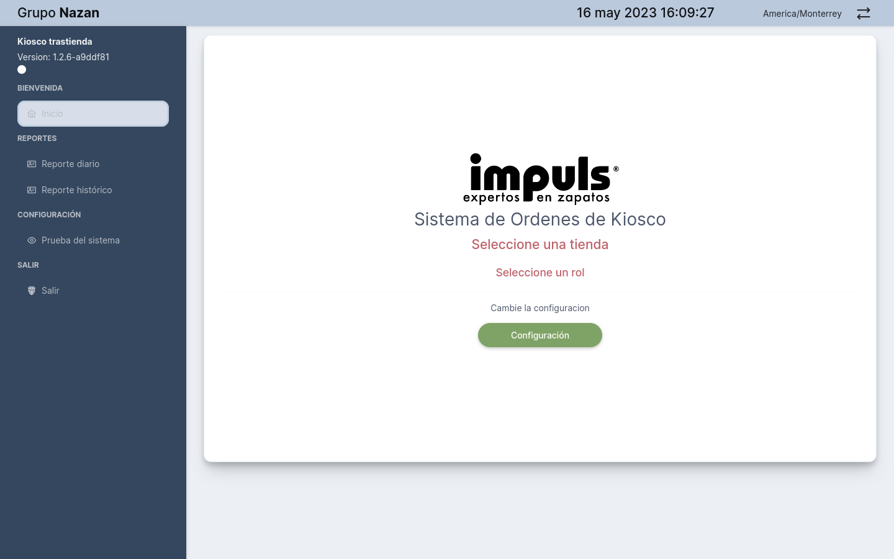

> Cuando iniciamos el sistema, nos muestra la interfaz del dashboard en la vista welcome/home, que tiene una tarjeta con las siguientes características: El icono de la tienda, el nombre del sistema, dirección ip de la tienda, un botón para realizar la configuración inicial, que nos permite seleccionar la tienda, el tipo de Rol del usuario y los nombres de los usuarios. 

---

### Configuración Usuario Rol Mostrador

---

::: info <Badge type="info" text="MENÚ - USUARIO ROL MOSTRADOR"/>
---

 **Descripción del Dashboard:**

1. Fecha y hora, ciudad
2. Logo de la Tienda
3. Nombre de la aplicación
4. Dirección Ip servidor
5. Nombre de la Tienda seleccionada
6. Fecha y hora
7. Usuarios autenticados y direcciones ip Autorizadas
8. Botón configuración
9. Logo Grupo Nazan  
10. Menú Principal
 
:::

## Seleccionar una tienda

---

> Para selecionar una tienda se debe hacer clic en el nombre de la tienda, que posteriormente saldrá un cuadro de mensaje pidiendo la confirmación de la selección con la opciones si/no, seleccionamos con el botón si para confirmar, saldra un mensaje notificando la confirmacion de la tienda seleccionada.  

--- 

---

---

::: tip <Badge type="info" text="MENÚ - CONFIGURACIÓN"/>

---

 **Configuración Inicial:**

1. Campo de busqueda de tienda
2. Listado de la Tienda
3. Seleccionar Tienda
4. Seleccionar Rol
5. Seleccionar Persona

:::

## Seleccionar un rol

::: tip ROL

> Continuando con la configuración ahora tendremos que seleccionar el rol del usuario que son: **almacen, mostrador o administrador**.
>

:::

---

::: tip SELECCIÓN

> Haciendo click en el número **2 ROL** nos muestra la opción para seleccionar un rol para el usuario que va a utilizar el sistema.

:::

::: tip CONFIRMACIÓN

> Ahora que seleccionamos el rol del usuario, sólo queda asignar el nombre del usuario y el codigo para finalizar con esta etapa de configuración.

:::

## Asignar Personal

::: tip ASIGNAR PERSONAL

> Continuando con la configuración ahora tendremos que asignar el personal para que pueda utilizar el sistema.

:::

---

---

::: tip CONFIRMADO

> Ya con la configuración inicial del usuario almacen realizada, el usuario debe navegar al menu principal y en el módulo Pedidos seleccionar la opción del menú Mostrador, haciendo clic, para mostrar el dasborad principal de pedidos en Mostrador.

:::

## Módulo Mostrador Inicio

## Módulo Mostrador Dashboard Principal

::: tip DASHBOARD PRINCIPAL PEDIDOS EN MOSTRADOR

> En la presente imagen podemos ver la interfaz gráfica del dashboard Mostrador.

:::

---

::: tip <Badge type="info" text="MOSTRADO - DASHBOARD"/>

---

 **Elementos de la interfáz:**

1. Selector de pedidos.
2. Listado pedidos en mostrador.
3. Pedidos entregados a los clientes.
   

:::

## Seleccionar Pedidos

---

::: tip SELECCIONAR PEDIDOS

 Para seleccionar un pedido y entregarlo al cliente desde el panel principal, es necesario buscar el botón gris ubicado encima de los pedidos en el mostrador. Al hacer clic en él, se habilita el selector de pedidos. Luego, para entregar el pedido, se debe hacer clic en el icono de flecha derecha, y el pedido se almacenará en la tabla de pedidos del mostrador

>

:::

## Detalles pedidos

---

---

::: tip DETALLES PEDIDOS

> Cuando se selecciona el icono <svg width="24px" height="24px" viewBox="0 0 24 24" fill="none" xmlns="http://www.w3.org/2000/svg" stroke=""><g id="SVGRepo_bgCarrier" stroke-width="0"></g><g id="SVGRepo_tracerCarrier" stroke-linecap="round" stroke-linejoin="round"></g><g id="SVGRepo_iconCarrier"> <path fill-rule="evenodd" clip-rule="evenodd" d="M6.30147 15.5771C4.77832 14.2684 3.6904 12.7726 3.18002 12C3.6904 11.2274 4.77832 9.73158 6.30147 8.42294C7.87402 7.07185 9.81574 6 12 6C14.1843 6 16.1261 7.07185 17.6986 8.42294C19.2218 9.73158 20.3097 11.2274 20.8201 12C20.3097 12.7726 19.2218 14.2684 17.6986 15.5771C16.1261 16.9282 14.1843 18 12 18C9.81574 18 7.87402 16.9282 6.30147 15.5771ZM12 4C9.14754 4 6.75717 5.39462 4.99812 6.90595C3.23268 8.42276 2.00757 10.1376 1.46387 10.9698C1.05306 11.5985 1.05306 12.4015 1.46387 13.0302C2.00757 13.8624 3.23268 15.5772 4.99812 17.0941C6.75717 18.6054 9.14754 20 12 20C14.8525 20 17.2429 18.6054 19.002 17.0941C20.7674 15.5772 21.9925 13.8624 22.5362 13.0302C22.947 12.4015 22.947 11.5985 22.5362 10.9698C21.9925 10.1376 20.7674 8.42276 19.002 6.90595C17.2429 5.39462 14.8525 4 12 4ZM10 12C10 10.8954 10.8955 10 12 10C13.1046 10 14 10.8954 14 12C14 13.1046 13.1046 14 12 14C10.8955 14 10 13.1046 10 12ZM12 8C9.7909 8 8.00004 9.79086 8.00004 12C8.00004 14.2091 9.7909 16 12 16C14.2092 16 16 14.2091 16 12C16 9.79086 14.2092 8 12 8Z" fill="#b8b8b8"></path> </g></svg> nos muestra un cuadro de mensaje con la siguiente información: Detalles del pedido, Número, del pedido **Pedido**, fecha en que se realizo el pedido **Fecha**, Estado del pedido **Status**, cantidad de items **Items**, adicional se muestra una tabla con los siguientes campos: **SKU** Código del producto, **Cantidad** número de la cantidad de items, **Descripcion** describre breve información sobre el producto.,**Internet** código del selservidor, **Catálogo** descripción detallada del producto.
>

:::

---

## Entrega Pedidos

---

---

---

::: tip ENTREGA DE PEDIDO

 En la imagen se puede observar un mensaje de dialogo mostrando la información del Tracking del Pedido que se describen a continuación: **Pedido** Número del pedido, **Fecha** fecha de creación del pedido, **Status** estado del tracking, **Items** Cantidad de item, **Tiempo de almacen** tiempo en respuesta para despachar el producto, tabiem se muestra una tabla con los siguientes campos: Fecha, Status, Comentarios. 
>

:::

## Entregar Pedido Cliente

---

---

::: tip PEDIDOS ENTREGADOS AL CLIENTE

> Haciendo clic sobre el icono 
 del campo acciones pasamos las ordenes pedidos en mostrador al listado pedidos entregados a los clientes.
>

:::

---

::: tip PASAR PEDIDOS A PICKING 

> Como se muestra en la imagen, aparece un cuadro de mensaje que indica que la orden se ha impreso correctamente y que se ha asignado correctamente.
>

:::

## Detalles Pedidos Entregados

---

---

::: tip VER DETALLES PEDIDO ENTREGADO

> Como se muestra en la imagen, aparece un cuadro de mensaje que indica los detalles del pedido: número de pedido, fecha y hora, status, items y una tabla con los detalle de cada items con los campos SKU, Cantidad, descripción.
 
:::

## Tracking del Pedidos Entregado

---

---

::: tip VER TRACKING PEDIDO ENTREGADO

> Como se muestra en la imagen, aparece un cuadro de mensaje que indica los detalles del pedido: número de pedido, fecha y hora, status, items, tiempo de almacen y una tabla con los detalle de cada items con los campos Fecha, Status, comentarios.
 
:::

### Pedidos expirados Detalles
---
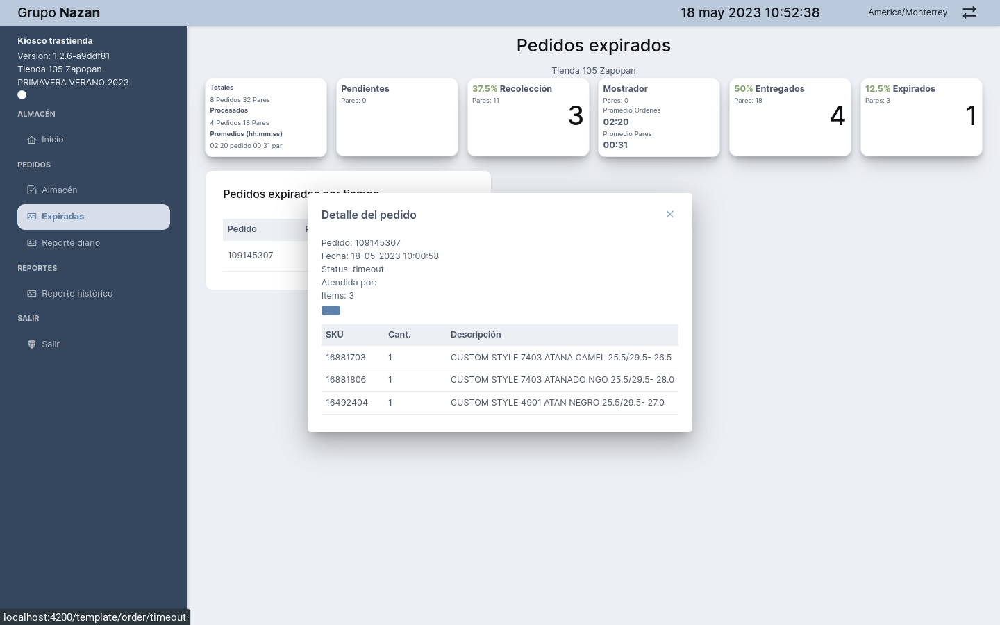

---
::: tip PEDIDOS EXPIRADOS POR TIEMPO

> En la imagen se puede observar los datos en detalle del pedido haciendo clic en el icono. 

:::

### Pedidos expirados Tracking
---

---
::: tip TRACKING DEL PEDIDO

> En la imagen se puede observar los datos en detalle del  Tracking del pedido haciendo clic en el icono. <svg width="24px" height="24px" viewBox="0 0 1024 1024" xmlns="http://www.w3.org/2000/svg" fill="#000000"><g id="SVGRepo_bgCarrier" stroke-width="0"></g><g id="SVGRepo_tracerCarrier" stroke-linecap="round" stroke-linejoin="round"></g><g id="SVGRepo_iconCarrier"><path fill="#b8b8b8" d="M512 896a384 384 0 1 0 0-768 384 384 0 0 0 0 768zm0 64a448 448 0 1 1 0-896 448 448 0 0 1 0 896z"></path><path fill="#b8b8b8" d="M480 256a32 32 0 0 1 32 32v256a32 32 0 0 1-64 0V288a32 32 0 0 1 32-32z"></path><path fill="#b8b8b8" d="M480 512h256q32 0 32 32t-32 32H480q-32 0-32-32t32-32z"></path></g></svg>

:::

## Reporte Diario

::: tip REPORTE DIARIO

> Este módulo contiene la información de la gestión de los pedidos, a través de una tabla que contiene los siguientes campos:

 >  1. **Pedido** 
 >  2. **Inicio de orden** 
 >  3. **Socio** 
 >  4. **Pares** 
 >  5. **Status Almacén** 
 >  6. **Duración** 
 >  7. **Nombre del perfil** 
 >  8. **Iconos ver detalles del pedido y tracking del pedido**

:::

### Menú Reporte diario

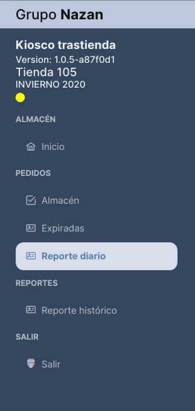

### Listado de Reporte diario

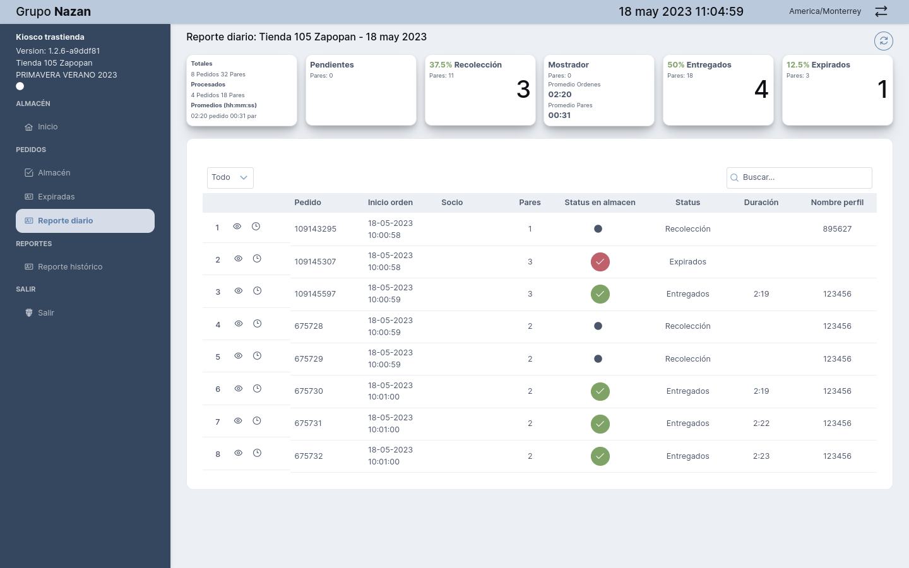

---

### Listado de Reporte diario filtros 

---

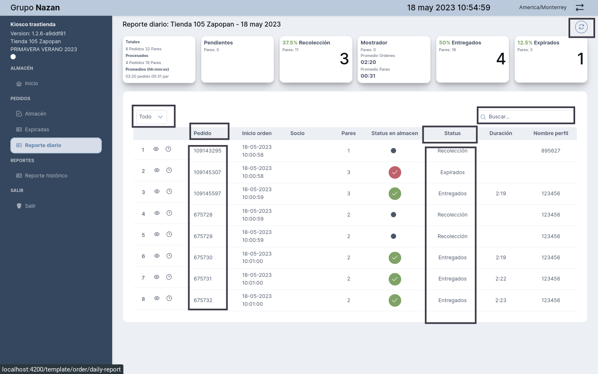

::: tip REPORTE DIARIO FILTROS

En la imagen se muestra un menú desplegable que permite al usuario aplicar diferentes filtros. Al seleccionar uno de los siguientes elementos (**Todos, Pendientes, Recolección, Mostrador, Entregado, Expirados**), solo se mostrarán los resultados que corresponden a esa opción. Además, el campo de búsqueda permite filtrar los resultados por número de pedido.

 
:::
---

::: tip REPORTE DIARIO ***FILTRO ENTREGADO***

En la imagen se muestra que al seleccionar el filtro 'Entregado' y luego ingresar el número correspondiente en el campo de búsqueda, se obtienen los datos de los pedidos que cumplen con este criterio específico.
 
:::

---

::: tip REPORTE DIARIO ***FILTRO EXPIRADO***

En la imagen podemos observar que al seleccionar el filtro de Expirado y colocando el número en el campo de busqueda nos trae los datos de los pedidos que cumplen con ese criterio.
 
:::

## Reporte Histórico

::: tip REPORTE HISTÓRICO

Este módulo incluye el informe completo del historial de pedidos, permitiendo al usuario buscar información en tiempo real a través del filtro de fechas. Además, cuenta con dos botones para descargar archivos en formato Excel, uno para las órdenes y otro para los productos, complemntando con los filtros del dropdown y el campo de busqueda.

:::

---

### Menú Reporte Histórico

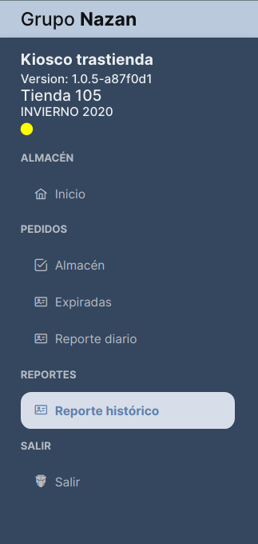

## Reporte Histórico

::: tip REPORTE HISTÓRICO

Este módulo incluye el informe completo del historial de pedidos, permitiendo al usuario buscar información en tiempo real a través del filtro de fecha. Además, cuenta con dos botones para descargar archivos en formato Excel, uno para las órdenes y otro para los productos, complementando con los filtros del dropdown (lista desplegable) y el campo de busqueda.

:::

---

### Módulo Reporte histórico 

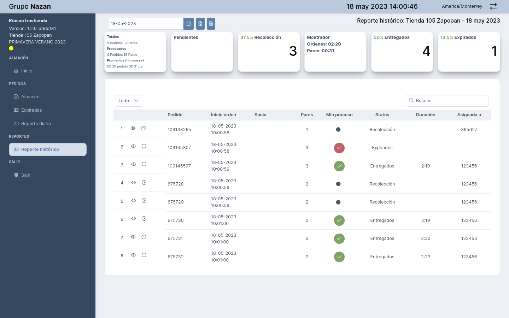

---
::: tip REPORTE HISTÓRICO

Este módulo incluye el informe completo del historial de pedidos, permitiendo al usuario buscar información en tiempo real a través del filtro de fecha. Además, cuenta con dos botones para descargar archivos en formato Excel, uno para las órdenes y otro para los productos, complementando con los filtros del dropdown (lista desplegable) y el campo de busqueda.

:::

---

### Módulo Reporte histórico Fecha

::: tip REPORTE HISTÓRICO FILTRO FECHA

Como se muestra en la imagen el campo fecha pérmite seleccionar entre fechas para buscar una orden.

:::

---

### Módulo Reporte histórico Fecha

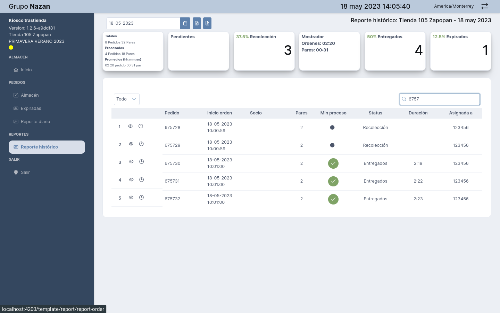

::: tip REPORTE HISTÓRICO FILTRO FECHA

Como se muestra en la imagen al momento de seleccionar la fecha, se muestra en la lista los registro ocurridos en la seleccion, también se pueden filtrar por el campo busqueda y el dropdown (lista desplegable) para hacer una consulta específica. 

:::

### Módulo Reporte histórico exportar Archivo

::: tip REPORTE HISTÓRICO EXPORTAR 

Como se muestra en la imagen hay dos botones para exportar los registros en formato de excel, en primer botón exporta el archivo por orden y el segundo botón por intems.

:::

---
### Exporta por Item

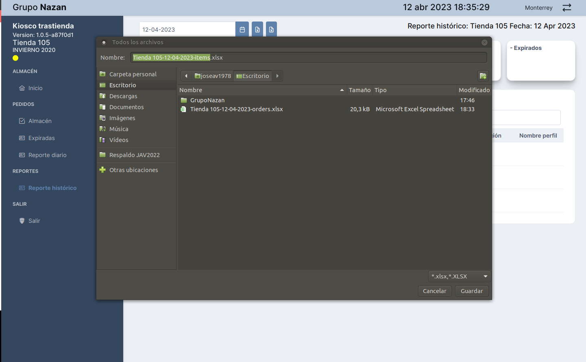

---

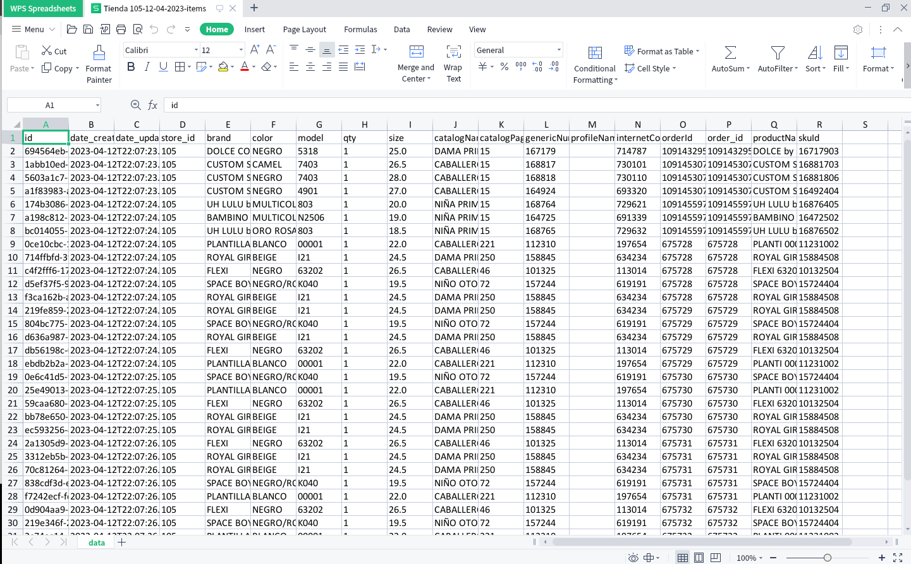

---

### Exporta por Order

---

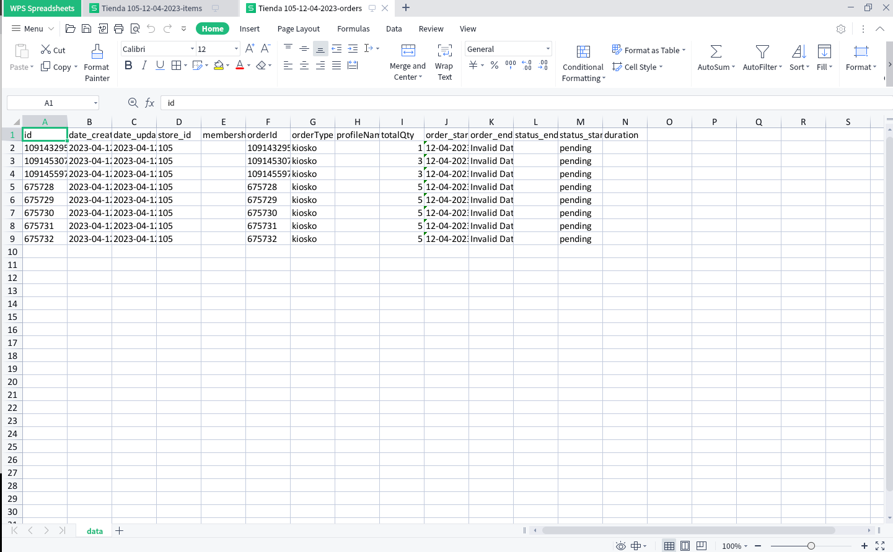

### Salir de la Aplicación

::: tip SALIR DEL SISTEMA 

Para **salir** del sistema seleccionamos el menú salir y cerramos el proceso, luego nos lleva al **dashboard welcome/home** para realizar las configuraciones iniciales al momento de un nuevo ingreso a la aplicación.

:::

---
### Dashboard Inicio

